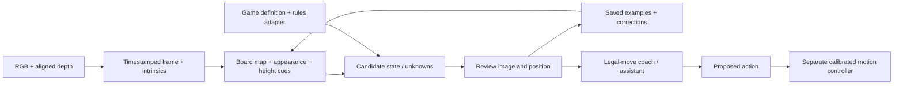

# Guided game study and the local Cerebro interface

This local development milestone starts with the operator's standard chess
setup on the actual gray/white Maker Faire board and marble pieces. It does
not require a pretrained chess detector. Watching frames does not retrain a
foundation model, and game predictions are not connected to the arms.

The game loop currently proposes moves for a person to perform. Manipulation
needs measured board-to-robot geometry, arm frames, tools, grasp planning,
collision checks and a validated stop path. A 2D board map is never treated
as calibrated robot coordinates.

## Chess Study

Open **Development → Chess Study (Observe & Teach)…** in Cerebro build 3.
The independent **ROB Chess Study.app** uses the same study code for imported
images without the robot application delegate or actuator clients.

1. Create a new session. Its diagram starts with standard chess.
2. Aim the camera so all 64 squares are visible. Keep the board and camera
   fixed. A raised downward view reduces piece overlap. Gray/white is fine.
3. Start the main camera, then **Freeze for review**. Mark the outer corners
   of the playing area in semantic **a8 → h8 → h1 → a1** order. These are the
   outside edges, not the centers of the corner squares. Check the grid.
4. Check the entire image against the diagram, including orientation and
   king/queen placement. Check the review box and save the shown position.
5. Resume observation. Make one move by hand, then clear your hands. After
   three steady live observations the app can suggest matching legal moves.
   Freeze, select or enter a UCI move such as e2e4, and inspect the resulting
   diagram before **Confirm move + teach**.
6. Use **Correct position…** when the confirmed game falls out of sync.
   Corrections preserve the audit history. Re-reviewing the same image
   supersedes its earlier training labels.
7. **Suggest ROB move** uses a modest two-ply material/rules coach. It is not
   a strong trained chess engine and never moves a physical piece.

Castling, en passant, promotion, king safety, checkmate and stalemate are
represented. Tournament clocks, repetition claims, draw agreements and all
competition procedures are not implemented. Rules reference:
[FIDE Laws of Chess](https://handbook.fide.com/chapter/e012023).

Board mapping uses a planar projective transform; see OpenCV's
[homography explanation](https://docs.opencv.org/4.5.2/d9/dab/tutorial_homography.html).
This rectifies the board plane, not the tops of tall pieces. Low camera angles,
occlusion, marble reflections, camera movement or lighting changes can make
appearances ambiguous. Every saved position requires review.

## Learning and evidence

An approved frame saves its source image, rectified board, 64 square labels,
FEN, optional move, map revision, frame identity, timestamps and image hashes.
Aligned depth and intrinsics are preserved when available. Distinct reviewed
appearances form a bounded nearest-example memory. Corrections replace
superseded examples when that memory is rebuilt.

For similar marble queens and bishops, the app can fit a camera-frame board
plane from known empty squares and estimate heights above it. Inadequate
fits are rejected and missing depth stays missing. These are appearance cues,
not millimeter-accuracy claims or certified grasp surfaces.

Labels describe **square occupancy**. Square polygons are not tight piece
bounding boxes. Training a general detector later needs reviewed object boxes
or masks and held-out sessions/viewpoints. Adjacent frames from one game must
not be split across training and validation.

## Local command interface

Cerebro polls a private same-user directory at
~/Library/Application Support/Cerebro/AgentBridge. This interface has no
network listener, shell evaluator, arbitrary selector, raw serial command,
arbitrary destination path, or general arm/tread motion operation.

Both clients are bundled with Cerebro in Contents/Resources. Run the standard-library
Python client from this repository, or call the installed cerebro-agent.py directly:

    Scripts/cerebro-agent.py status
    Scripts/cerebro-agent.py capture
    Scripts/cerebro-agent.py camera-hold on
    Scripts/cerebro-agent.py camera-nudge upper -100
    Scripts/cerebro-agent.py capture
    Scripts/cerebro-agent.py harvest --count 6 --interval 2
    Scripts/cerebro-agent.py observe off
    Scripts/cerebro-agent.py camera-hold off

**capture** returns a directory containing rgb.jpg, frame.json, and optionally
depth-u16le-mm.raw. Depth is aligned UInt16 little-endian millimeters; zero
means invalid. Captures are unreviewed. Robot command state is sampled at
export, not measured shaft feedback or synchronized robot extrinsics.

**camera-hold on** pauses automatic person-camera tracking without issuing a
servo target. Keep it on for a stationary board. It stays held if the CLI
exits; release explicitly when finished. Capture demand is separate, so
observe off does not release the hold.

**camera-nudge** supports upper tilt or pan only, at most 100 Maestro target
units per request, preserving the lower-neck target. Units are not degrees.
The runtime rejects changed expected poses, unsettled startup/transitions,
active Follow/autonomy/shows, and requests outside configured neck limits.
Commands pass through the existing operator neck gateway and report its
disposition. Inspect a fresh image after settling. Never batch blind nudges.

Requests have UUIDs, strict schemas and short deadlines. Expired, replayed,
oversized and unknown operations are rejected. Permissions restrict access
to the signed-in robot account; this is not a separate sandbox against other
code already running as that account.

**stop** invokes the existing priority software stop and cancels a stage show.
It stops base/follow/autonomy activity and leaves camera tracking held. It is
not a power cutoff or a new universal Amber-arm stop; the dedicated arm stop
lane remains separate.

## Teaching another game

The game-study.py tool supports custom rectangular boards, piece vocabularies,
written rules, image analysis and explicit teaching. It uses the locally
installed Pillow package and processes images locally.

    Scripts/game-study.py --project ~/Documents/ROB-Games/MarbleChess new \
      --name "Maker Faire Marble Chess" --preset chess
    Scripts/game-study.py --project ~/Documents/ROB-Games/TokenGame new \
      --name "New token game" --rows 4 --columns 6 \
      --classes empty red_token blue_token --rules /path/to/rules.md

Use **calibrate --corners '[[x,y],…]'** with four normalized corners in semantic
top-left, top-right, bottom-right, bottom-left order. For chess these are
a8, h8, h1, a1. Then **analyze --capture /path/from/cerebro-agent** generates a
rectified board, review overlay and JSON alternatives/unknowns.

Edit labels-to-review.json and explicitly teach the reviewed frame:

    Scripts/game-study.py --project /path/to/project teach \
      --capture /path/to/capture --labels /path/to/reviewed-labels.json \
      --confirmed --note "Operator reviewed the board and demonstrated move."

Analysis never teaches its own predictions. New-game rules are **provided,
not executable** until an explicit rules/state adapter is implemented and
validated. A few observed moves cannot uniquely determine all unfamiliar
game rules.

## Validation and distribution

- Scripts/test-chess-study.sh checks reference chess move counts, special
  moves, gray-board image changes, image orientation, board geometry, depth
  heights, ambiguous appearances, persistence and bounded commands.
- Tests/ROBGameStudyFixtureTests.py checks custom projects, review gating,
  unknowns, correction history and image tampering.
- Existing Follow and headless-camera checks still apply.
- Scripts/build-chess-study.sh builds the independent image workbench.
- Cerebro build 3 uses Apple Development signing for local installation.

This is not an App Store or website release. Real-board recognition accuracy
and physical manipulation must be measured separately from software fixtures.
