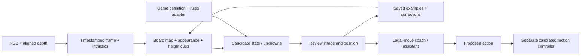

# Guided game study and the local Cerebro interface

This local development milestone starts with the operator's standard chess
setup on the actual gray/white Maker Faire board and marble pieces. It does
not require a pretrained chess detector. Watching frames does not retrain a
foundation model, and game predictions are not connected to the arms.



The game loop currently proposes moves for a person to perform. Manipulation
needs measured board-to-robot geometry, arm frames, tools, grasp planning,
collision checks and a validated stop path. A 2D board map is never treated
as calibrated robot coordinates.

## Chess Study

Open **Development → Chess Study (Observe & Teach)…** in Cerebro.
The independent **ROB Chess Study.app** uses the same study code for imported
images without the robot application delegate or actuator clients.

1. Create a new session. Its diagram starts with standard chess.
2. Aim the camera so all 64 squares are visible. Keep the board and camera
   fixed. A raised downward view reduces piece overlap. Gray/white is fine.
3. Start the main camera, then **Freeze for review**. Mark the outer corners
   of the playing area in semantic **a8 → h8 → h1 → a1** order. These are the
   outside edges, not the centers of the corner squares. Check the grid.
4. Check the entire image against the diagram, including orientation and
   king/queen placement. Check the review box and save the shown position.
5. Resume observation. Make one move by hand, then clear your hands. After
   three steady live observations the app can suggest matching legal moves.
   Freeze, select or enter a UCI move such as e2e4, and inspect the resulting
   diagram before **Confirm move + teach**.
6. Use **Correct position…** when the confirmed game falls out of sync.
   Corrections preserve the audit history. Re-reviewing the same image
   supersedes its earlier training labels.
7. **Suggest ROB move** uses a modest two-ply material/rules coach. It is not
   a strong trained chess engine and never moves a physical piece.

In local build 4, **Fit to Screen** fills the current monitor's usable area.
Resize any window edge to give the camera more room; the image, grid and
corner clicks share an aspect-fit rectangle, so resizing does not stretch
the image or move saved corners relative to it. **Enlarge camera** hides the
review panel, and **Show review panel** brings it back. Marking corners opens
the enlarged view automatically. Short windows scroll the review controls.
Window size and the camera expansion preference are remembered.

Opening a saved session restores its last reviewed board map and comparison
baseline. No current frame is restored: obtain a fresh camera image, freeze
it, and check the grid and all squares before teaching. Re-mark the board if
the physical framing changed. Recall the named camera pose in Servo Control
before checking the grid when returning to a repeatable setup.

Castling, en passant, promotion, king safety, checkmate and stalemate are
represented. Tournament clocks, repetition claims, draw agreements and all
competition procedures are not implemented. Rules reference:
[FIDE Laws of Chess](https://handbook.fide.com/chapter/e012023).

Board mapping uses a planar projective transform; see OpenCV's
[homography explanation](https://docs.opencv.org/4.5.2/d9/dab/tutorial_homography.html).
This rectifies the board plane, not the tops of tall pieces. Low camera angles,
occlusion, marble reflections, camera movement or lighting changes can make
appearances ambiguous. Every saved position requires review.

## Learning and evidence

An approved frame saves its source image, rectified board, 64 square labels,
FEN, optional move, map revision, frame identity, timestamps and image hashes.
Aligned depth and intrinsics are preserved when available. Distinct reviewed
appearances form a bounded nearest-example memory. Corrections replace
superseded examples when that memory is rebuilt.

For similar marble queens and bishops, the app can fit a camera-frame board
plane from known empty squares and estimate heights above it. Depth samples
are assigned using their 3D footprints on that plane, so a tall piece's image
projection does not automatically assign its height to the next square. Inadequate
fits are rejected and missing depth stays missing. These are appearance cues,
not millimeter-accuracy claims or certified grasp surfaces.

Labels describe **square occupancy**. Square polygons are not tight piece
bounding boxes. Training a general detector later needs reviewed object boxes
or masks and held-out sessions/viewpoints. Adjacent frames from one game must
not be split across training and validation.

## Local command interface

Cerebro polls a private same-user directory at
~/Library/Application Support/Cerebro/AgentBridge. This interface has no
network listener, shell evaluator, arbitrary selector, raw serial command,
arbitrary destination path, or general arm/tread motion operation.

Both clients are bundled with Cerebro in Contents/Resources. Run the standard-library
Python client from this repository, or call the installed cerebro-agent.py directly:

    Scripts/cerebro-agent.py status
    Scripts/cerebro-agent.py capture
    Scripts/cerebro-agent.py camera-hold on
    Scripts/cerebro-agent.py camera-nudge upper -100
    Scripts/cerebro-agent.py capture
    Scripts/cerebro-agent.py harvest --count 6 --interval 2
    Scripts/cerebro-agent.py observe off
    Scripts/cerebro-agent.py camera-hold off

On ROB, convenience links are installed at ~/bin/cerebro-agent and
~/bin/rob-game-study. They resolve to the clients bundled in /Applications/Cerebro.app.

**capture** returns a directory containing rgb.jpg, frame.json, and optionally
depth-u16le-mm.raw. Depth is aligned UInt16 little-endian millimeters; zero
means invalid. Captures are unreviewed. Robot command state is sampled at
export, not measured shaft feedback or synchronized robot extrinsics.

**camera-hold on** pauses automatic person-camera tracking without issuing a
servo target. An already-running transition may finish before nudges become
available; the hold blocks new tracking targets during that wait.
Keep it on for a stationary board. It stays held if the CLI
exits; release explicitly when finished. Capture demand is separate, so
observe off does not release the hold.

**camera-nudge** supports upper tilt or pan only, at most 100 Maestro target
units per request, preserving the lower-neck target. Units are not degrees.
The runtime rejects changed expected poses, unsettled startup/transitions,
active Follow/autonomy/shows, and requests outside configured neck limits.
Commands pass through the existing operator neck gateway and report its
disposition. Inspect a fresh image after settling. Never batch blind nudges.

Requests have UUIDs, strict schemas and short deadlines. Expired, replayed,
oversized and unknown operations are rejected. Permissions restrict access
to the signed-in robot account; this is not a separate sandbox against other
code already running as that account.

**stop** invokes the existing priority software stop and cancels a stage show.
It stops base/follow/autonomy activity and leaves camera tracking held. It is
not a power cutoff or a new universal Amber-arm stop; the dedicated arm stop
lane remains separate.

## Teaching another game

The game-study.py tool supports custom rectangular boards, piece vocabularies,
written rules, image analysis and explicit teaching. It uses the locally
installed Pillow package and processes images locally.

    Scripts/game-study.py --project ~/Documents/ROB-Games/MarbleChess new \
      --name "Maker Faire Marble Chess" --preset chess
    Scripts/game-study.py --project ~/Documents/ROB-Games/TokenGame new \
      --name "New token game" --rows 4 --columns 6 \
      --classes empty red_token blue_token --rules /path/to/rules.md

Use **calibrate --corners '[[x,y],…]'** with four normalized corners in semantic
top-left, top-right, bottom-right, bottom-left order. For chess these are
a8, h8, h1, a1. Then **analyze --capture /path/from/cerebro-agent** generates a
rectified board, review overlay and JSON alternatives/unknowns.

Edit labels-to-review.json and explicitly teach the reviewed frame:

    Scripts/game-study.py --project /path/to/project teach \
      --capture /path/to/capture --labels /path/to/reviewed-labels.json \
      --confirmed --note "Operator reviewed the board and demonstrated move."

Analysis never teaches its own predictions. New-game rules are **provided,
not executable** until an explicit rules/state adapter is implemented and
validated. A few observed moves cannot uniquely determine all unfamiliar
game rules.

## Validation and distribution

- Scripts/test-chess-study.sh checks reference chess move counts, special
  moves, gray-board image changes, image orientation, board geometry, depth
  heights, ambiguous appearances, persistence and bounded commands.
- Tests/ROBGameStudyFixtureTests.py checks custom projects, review gating,
  unknowns, correction history and image tampering.
- Existing Follow and headless-camera checks still apply.
- Scripts/build-chess-study.sh builds the independent image workbench.
- Cerebro build 3 uses Apple Development signing for local installation.

This is not an App Store or website release. Real-board recognition accuracy
and physical manipulation must be measured separately from software fixtures.

## ROB installation and first real-board session — September 13, 2026

The Apple Development signed build 3 from source commit `19e7b5b` was installed
at /Applications/Cerebro.app and started through the existing per-user
supervisor. Strict signature verification passed. The standalone image
workbench in ~/Downloads/ROB Chess Study.app was rebuilt from the same source.
The original build 2 remains in ~/Downloads/Cerebro Before Chess Study - 2026-09-13.app.

The actual gray/white Maker Faire board is framed with white nearest ROB.
The camera was lowered in individually inspected steps of 100 target units;
after the final restart it was restored using the same bounded process.
Commanded targets at handoff are pan 5799, lower 7014, upper 6798. Lower stayed
at 7014 throughout the CLI adjustments. These are command references, not
shaft measurements or a pose to replay without checking the hardware.
Camera hold remains on; Follow, autonomy and stage shows are inactive.

Local evidence is in ~/Documents/ROB-Games/MakerFaire-Marble-Chess:

- Six initial RGB-D captures, metadata and intrinsics are copied into unreviewed/.
- board-annotated.png shows the initial camera-plane map.
- records/ contains the first reviewed starting-position example for the
  general-game client. Starting identities use the operator-confirmed standard
  setup and visual review, not independent neural classification.
- Guided Chess Session/ contains the native live RGB-D baseline, all 64 square
  labels, FEN, source/board hashes and optional height estimates.
- installed-build.json records source identity and installed artifact hashes.

An adjacent-frame appearance comparison left one square unknown and flagged
glare on d4. It did not accept a move. That comparison is not an independent
accuracy evaluation. The first native record had 54 of 64 height cues; some
dark marble pieces still lacked usable depth, and the opposite-side bishop
cue was ambiguous. Height alone is not sufficient to label this set.

All 56 Swift fixture checks passed, including the projected tall-piece case,
response publication and special chess moves. Depth IPC, general-game
fixtures, existing Follow safety and headless-camera checks passed. Live CLI
status, hold, capture, bounded nudges, harvest and native baseline persistence
were exercised on ROB. The next human-demonstrated move remains a separate
real-board validation step.

## Connecting the conversation and motion layers

The existing Main AI voice conversation has its own runtime. This milestone
does not automatically inject Chess Study's verified state into that voice
conversation. An assistant using the local CLI can inspect current frames and
the saved teaching records now. Voice grounding should consume the same
reviewed FEN, observation time, unknowns and legal proposals; it must distinguish
saved state from a fresh visual observation. Learning another game's appearance
uses the project workflow above; legal reasoning needs that game's rules adapter.

Arm actions remain a separate stage: measure the board frame relative to ROB,
calibrate the actual arm mounts and encoders, simulate reach and collision,
then validate a low-speed grasp with feedback. No game recognition result is
currently converted into an arm, gripper, tread or torso movement command.

## Belly-camera evidence alongside the main view

The existing **Recording → Open Recording Control → Start Training Session**
can capture **Face RGB-D** and **Belly RGB-D** together at 2 fps. Stop after a
short clip with the board still and hands clear. This uses the running camera
streams without changing resolution or restarting Cerebro. The recording also
contains the recorder's existing telemetry; the chess importer reads only its
camera evidence and manifest.

`Scripts/chess-multiview.py` imports a completed recording into an existing
chess project's `multiview/` directory. It preserves each camera's original
JPEG, aligned millimeter depth, intrinsics, device timestamp, host receipt
time and recorded calibration. Images and metadata have SHA-256 checksums.
Any saved camera-to-robot pose remains unvalidated for this board.

```sh
python3 Scripts/chess-multiview.py import \
  --project ~/Documents/ROB-Games/MakerFaire-Marble-Chess \
  --recording "/path/to/completed/Training/recording"

python3 Scripts/chess-multiview.py review \
  --session "/path/returned/by/import" --pair pair-0010 \
  --native-session "/path/to/Guided Chess Session" \
  --record-id NATIVE_RECORD_UUID --confirmed \
  --note "Both images checked; the board stayed in this saved position."

python3 Scripts/chess-multiview.py annotate \
  --session "/path/returned/by/import" --review-id REVIEW_UUID \
  --camera belly --square d1 --box 272 19 322 122 \
  --visibility clear --confirmed --note "Queen identity and crop reviewed."
```

The example box belongs to the September 13 capture; choose bounds from the
actual image each time. `--confirmed` records the operator's visual review,
not an automatic recognition result. A position review associates only the
selected pair with a snapshot of the native FEN. Other pairs stay unreviewed.
It does not modify the native move history or copy 64 square labels into the
belly image. Individual crop annotations retain clear/partial visibility,
source hashes and the reviewed square context. Rectangles use the camera's
own pixels; no main-camera homography is reused for the belly view.

Open the generated, self-contained `review.html` for a two-view gallery with
reviewed boxes, the position reference and a timeline. Its images are embedded
locally; it loads no remote resources. The import allows at most 300 frames
per camera and 32 MB of RGB images in this portable page.

Pairs use chronological nearest available **host recorder receipt** times,
with a default maximum difference of 250 ms and no reused belly frames.
These timestamps are recorded when the recorder processes a frame, so their
difference is not an exposure-time bound. Device clocks remain separate.
For an operator-confirmed stationary board, different capture instants can
still show the same position. Records therefore distinguish
`stationarySceneConfirmed` from hardware exposure synchronization. Moving
hands, pieces or arms require exposure timing and motion checks before fusion.

This adds reviewed side-view examples and raw depth to the teaching dataset.
The native automatic matcher still uses the main camera. Bounding-box pixel
height is not physical piece height: millimeter heights remain unset until a
board plane and depth support are validated in that camera. Metric fusion and
grasp coordinates additionally require the relevant coordinate transforms.
The belly's lower angle reveals silhouettes while the front row can obscure
pieces behind it; hidden identities are not filled in automatically.

On September 13, the first real clip produced 18 face frames and 19 belly
frames, all with aligned depth, forming 18 receipt-time pairs. Pair 10 was
visually reviewed against **1. e4 e5 2. Nf3 Nc6 3. Bc4**. The belly queen at d1
and bishop at c1 received individual crop labels; the bishop crop is marked
partial because neighboring pieces overlap its region. These local images
are not committed to Git. No robot commands or public release are involved.

Run `python3 Tests/ROBChessMultiViewTests.py` for import, independent device
clocks, stale-pair and frame-reuse rejection, review gates, invalid files,
depth integrity and rollback checks. The running build remains build 3; this
offline adapter needs no Cerebro binary replacement.
